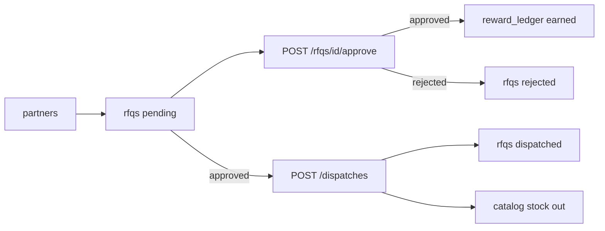

# Database flow handoff (technical)

**Date:** 2026-09-23  
**Audience:** Developers wiring APIs / DB  

**Share with designers first:** [`2026-09-23-06-database-flow-simple.md`](./2026-09-23-06-database-flow-simple.md) — plain language, no MongoDB jargon.

This file complements the raw MongoDB schema (collections + fields).

## Schema vs flow

| | Schema | Flow |
|---|--------|------|
| **What** | Collection names, field names, types | Who creates what, in what order, which API writes which collection |
| **Use for** | Types, forms, validation | Navigation, loading states, empty states, status badges, disabled actions |
| **Where in repo** | `DASHBOARD.md` (collections), Compass export | This file + `frontend/src/api/endpoints.ts` |

**One-liner for chat:**  
> DB schema is the collections list; **flow** is: master data setup → purchase increases **catalog.stock** → partner **RFQ pending** → admin **approve** may write **reward_ledger** → **dispatch** from approved RFQ reduces stock; overview is **GET /api/dashboard/snapshot**. API ↔ collection notes live in `frontend/src/api/endpoints.ts`.

## MongoDB basics

```text
mongodb://127.0.0.1:27017
Database: quotation_db
```

All routes: prefix `/api`. Response envelope: `{ "success", "data", "error" }`.  
Admin calls use Bearer token (see `frontend/src/api/client.ts`).

### Collections (quick reference)

**Original**

- `users` — admin accounts, requesters, team users
- `categories`, `catalog`, `money_config`
- `admin_tokens` — opaque admin login tokens

**Business extensions**

- `subcategories` — `categoryId` → categories
- `brands`
- `product_groups` — groups of 2+ product IDs
- `racks` — warehouse slots (`productId` per slot)
- `purchases` — stock receipts
- `rfqs` — quotation requests + approval history
- `dispatches` — from approved RFQ or retail
- `partners` — referral partners + KYC
- `reward_ledger` — earned/redeemed events (no stored wallet balance on partner)

Full field notes: `DASHBOARD.md` in repo root.

---

## Flow A — Master data (setup order)

Admin UI should assume this dependency order when guiding “create first” empty states:

```text
categories
  → subcategories (categoryId)
  → brands
  → catalog / products (category, subcategoryId, brandId, optional productGroupIds, rackId/slot)
  → product_groups (2+ product IDs)
  → racks (slots can reference productId)
```

**Typical APIs**

- `/api/categories`, `/api/subcategories`, `/api/brands`
- `/api/catalog`, `/api/catalog/import`
- `/api/product-groups`, `/api/racks`

**Admin screens (Expo)** — `frontend/app/(admin)/`

| Screen | APIs |
|--------|------|
| categories.tsx | categories |
| subcategories.tsx | subcategories |
| brands.tsx | brands |
| catalog.tsx | catalog |
| product-groups.tsx | product-groups |
| racks.tsx | racks |

---

## Flow B — Stock in (purchase)

```text
POST /api/purchases
  → inserts purchases
  → updates catalog.stock (and related fields: lastPurchasePrice, rack on lines when provided)
```

Inventory screens **read** aggregated stock and movement; they do not replace purchase as the stock-in write path.

**APIs:** `/api/purchases`, `/api/inventory`, `/api/inventory/low-stock`, `/api/inventory/transactions`  
**Screen:** `purchases.tsx`, `inventory.tsx`

---

## Flow C — RFQ → rewards → dispatch (core product flow)

**Do not remove or shortcut this chain** when adding admin features.

### Status lifecycle (RFQ)

```text
created → status: pending
admin POST /api/rfqs/{id}/approve
  → approved OR rejected
  → if approved: grandTotal / discount applied server-side; reward points calculated server-side
approved RFQ only:
  POST /api/dispatches (with source RFQ)
  → RFQ status → dispatched
  → stock reduced on catalog for dispatched lines
```

### Rules (for UI copy and button enablement)

1. **RFQ creation** — zero reward points at create time.
2. **Approval** — points = server formula (currently `floor(grandTotal / 100)` when approved).
3. **reward_ledger** — at most **one** `type: "earned"` row per RFQ (`quotationId` = RFQ id); re-approval does not duplicate.
4. **Partner balance** — computed from ledger (`earned − redeemed`), not a primary balance field on `partners` (UI may show `rewardBalance` as API-computed).
5. **Dispatch** — only when RFQ `status === "approved"` (409 otherwise). Retail dispatch path exists without RFQ on dispatch screen.

### Diagram (paste into FigJam / Mermaid tools if needed)



**APIs:** `/api/rfqs`, `/api/rfqs/{id}/approve`, `/api/rfqs/{id}/history`, `/api/dispatches`  
**Screens:** `rfqs.tsx`, `dispatches.tsx`, `partners.tsx` (passbook via rewards endpoint)

More detail: `DASHBOARD.md` → “RFQ flow” and `Reward_System_Design_Spec.md`.

---

## Flow D — Partners and KYC

```text
POST /api/partners/register
  → partners (kycStatus: pending)

POST /api/partners/{id}/kyc
  → approved | rejected
  → appActive, kycHistory updated

GET /api/partners/{id}/rewards
  → balance + ledger entries (reward_ledger)
```

RFQs reference `partnerId`. Partner list may show sales performance from approved/dispatched RFQs.

**Screen:** `partners.tsx`

---

## Flow E — Dashboard overview (single read model)

One call powers the home snapshot:

```text
GET /api/dashboard/snapshot
```

Aggregates: catalog counts, stock units, low stock, RFQ status counts, pending RFQ short list, partner KYC ratio, 7d dispatch value, top/slow movers.

**Doc:** `demo-notes/2026-09-20-04-overview-snapshot.md`  
**Screen:** `dashboard.tsx`

---

## Flow F — Auth and quotation (requester vs admin)

**Admin**

```text
POST /api/auth/admin/register | /login
  → admin_tokens
  → Bearer on subsequent admin API calls
```

**Requester**

```text
POST /api/auth/requester/register → users
```

Live quotation **draft** (qty, unit price, totals) is largely **client-side** until submitted as business RFQ:

- `frontend/src/state/draft.ts` — draft + money math
- `frontend/app/(admin)/money-config.tsx` + `money_config` — discount / GST / visibility per admin

Requester/mobile quotation screens (if in scope) use catalog read APIs + local draft; RFQ write goes to `/api/rfqs`.

---

## Screen → API → collections (admin)

| Screen | Main APIs | Collections written (typical) |
|--------|-----------|-------------------------------|
| dashboard.tsx | GET `/dashboard/snapshot` | read-only aggregate |
| categories.tsx | `/categories` | categories |
| subcategories.tsx | `/subcategories` | subcategories |
| brands.tsx | `/brands` | brands |
| catalog.tsx, csv-import.tsx | `/catalog`, import | catalog, categories |
| product-groups.tsx | `/product-groups` | product_groups, catalog refs |
| racks.tsx | `/racks` | racks, catalog slot refs |
| purchases.tsx | `/purchases` | purchases, catalog |
| rfqs.tsx | `/rfqs`, approve, history | rfqs, reward_ledger |
| dispatches.tsx | `/dispatches` | dispatches, rfqs, catalog |
| inventory.tsx | `/inventory`, low-stock, transactions | read-heavy |
| partners.tsx | `/partners`, kyc, rewards | partners, reward_ledger (read) |
| team.tsx | `/team/users` | users |
| money-config.tsx | `/money-config/{adminId}` | money_config |

Typed wrappers and `NOTE (DB)` comments: **`frontend/src/api/endpoints.ts`**.

---

## Team roles (metadata today)

Stored on `users` — shown on team screen; **not** full route-level auth middleware yet.

| Role | Intent |
|------|--------|
| admin | all |
| store_manager | catalog read, purchase write, inventory read, RFQ approve, dispatch write |
| staff | catalog read, inventory read |

Design implication: assume admin token for now; future permission gates may hide actions per role.

---

## Related repo docs

| File | Purpose |
|------|---------|
| `DASHBOARD.md` | Full handoff: collections, rewards, API list, run locally |
| `frontend/src/api/endpoints.ts` | Every frontend call + DB notes |
| `Reward_System_Design_Spec.md` | Ledger reward blueprint |
| `demo-notes/2026-09-23-05-mongodb-indexes.md` | Indexes (performance, not flow) |

## Suggested formats when sharing

1. **This `.md` file** — attach or link in Slack/Teams/email.
2. **Optional 5 min screen recording** — login → snapshot → pending RFQ → approve → partner rewards → dispatch.
3. **FigJam** — redraw Flow C boxes if they need a visual workshop.
