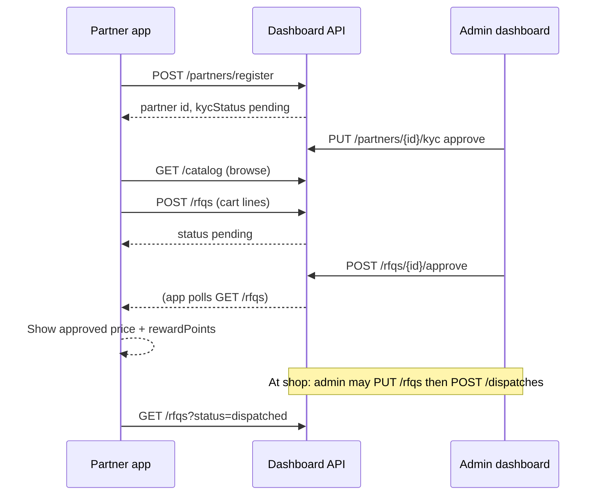

# RFQ integration guide (partner / mobile app)

Send this file to your mobile developer. It covers **only the RFQ (Request for Quotation) flow** — how to submit a quote request from the app and read status after admin action.

**Related:** product browse and catalog fields → [MOBILE_APP_API_HANDOFF.md](./MOBILE_APP_API_HANDOFF.md)

---

## Base URL

```text
Production: https://python-api-6aft.onrender.com/api
Local:      http://<host>:8000/api   (or 8001 — match backend port)
```

Every JSON response:

```json
{ "success": true, "data": { }, "error": null }
```

If `success` is `false`, show `error` to the user. Read **`data`** on success.

**Auth:** Partner RFQ routes do **not** need admin login. No Bearer token required today.

---

## End-to-end flow



| Step | Who | What |
| --- | --- | --- |
| 1 | App | Register partner → store **`partnerId`** |
| 2 | Admin | Approve KYC in dashboard |
| 3 | App | Build cart from **`GET /catalog`** (`productCode`, `sellingPrice`, `stock`) |
| 4 | App | **`POST /rfqs`** → status **`pending`** |
| 5 | Admin | Approve/reject in **RFQ Management** |
| 6 | App | **`GET /rfqs?partner_id=...`** → show **`approved`** + **`rewardPoints`** |
| 7 | Admin | Edit lines at counter (optional), **dispatch** |
| 8 | App | List shows **`dispatched`** when done |

**Not implemented:** push notification when RFQ is approved — **poll** or refresh when user opens “My RFQs”.

---

## Step 1 — Partner account (register + login)

Use **phone + passcode** (min 4 digits). Full auth spec: **[PARTNER_APP_INTEGRATION.md](./PARTNER_APP_INTEGRATION.md)**.

```http
POST /api/auth/partner/register   → first time sign up (appears on admin Referral Partners)
POST /api/auth/partner/login      → returns token + partnerId (admin sees last login)
GET  /api/auth/partner/me         → Bearer token, restore session
```

After register/login, save **`partnerId`** (= `data.id` or login `partnerId`).

Legacy (no passcode): `POST /api/partners/register` — prefer **`/auth/partner/register`** for the app.

Check KYC anytime:

```http
GET /api/partners?search=<phone>
```

---

## Step 2 — Partner id (if you already registered without auth routes)

```http
POST /api/partners/register
```

Only if not using `/auth/partner/register` — **no login passcode**. Prefer auth routes above.

---

## Step 3 — Build the cart (catalog)

Use **`GET /api/catalog`** (see handoff doc). Each line in the RFQ needs:

| From catalog | Use in RFQ line |
| --- | --- |
| `productCode` | **`productCode`** (same as `qrCode` for scan) |
| `sellingPrice` or `standardRate` | Show estimate only; server sets **`unitPrice`** on create |
| `stock` | Optional: warn if qty > stock |

**On-device “Generate quotation” (PDF/text):** your UI only. **Submitting to the business** = **`POST /rfqs`** below.

---

## Step 4 — Create RFQ (submit quotation request)

```http
POST /api/rfqs
Content-Type: application/json
```

```json
{
  "partnerId": "abc-123-partner-uuid",
  "lines": [
    { "productCode": "M511130301", "quantity": 10 },
    { "productCode": "OTHER-CODE", "quantity": 2 }
  ],
  "deliveryMode": "storePickup",
  "scheduledAt": "2026-09-25 14:00"
}
```

| Field | Rules |
| --- | --- |
| `partnerId` | Required, non-empty string from register |
| `lines` | At least one line; each needs valid **`productCode`** in catalog and **`quantity` > 0 |
| `deliveryMode` | `"storePickup"` or `"homeDelivery"` |
| `scheduledAt` | Optional string (free text; e.g. date/time for pickup) |

**Success `data` (shape):**

```json
{
  "id": "rfq-uuid",
  "partnerId": "abc-123-partner-uuid",
  "status": "pending",
  "lines": [
    {
      "productId": "...",
      "productCode": "M511130301",
      "productName": "Product name",
      "quantity": 10,
      "unitPrice": 235.2
    }
  ],
  "grandTotal": 2352,
  "specialDiscountPercent": 0,
  "rewardPoints": 0,
  "deliveryMode": "storePickup",
  "scheduledAt": "2026-09-25 14:00",
  "createdAt": "2026-09-23T...",
  "updatedAt": "2026-09-23T...",
  "history": [{ "action": "created", "actor": "system", "at": "..." }]
}
```

**Errors (400):** `success: false`, `data.errors` may list e.g. `Line 1: valid product code and positive quantity are required`.

---

## Step 5 — List and track RFQs (partner app)

```http
GET /api/rfqs?partner_id=<partnerId>
GET /api/rfqs?partner_id=<partnerId>&status=pending
GET /api/rfqs?partner_id=<partnerId>&status=approved
GET /api/rfqs?partner_id=<partnerId>&status=rejected
GET /api/rfqs?partner_id=<partnerId>&status=dispatched
```

Returns **`data`**: array of RFQ objects (same shape as create response).

### Status meanings (show in UI)

| `status` | Partner message |
| --- | --- |
| `pending` | Waiting for admin approval |
| `approved` | Accepted — show **`grandTotal`**, **`specialDiscountPercent`**, **`rewardPoints`**, pickup/delivery |
| `rejected` | Declined |
| `dispatched` | Order fulfilled / billed at store |

After **approve**, server sets:

- **`specialDiscountPercent`** — extra discount admin applied  
- **`grandTotal`** — total after that discount  
- **`rewardPoints`** — `floor(grandTotal / 100)` on approve (integer)

Refresh **`GET /rfqs`** after submit and when user opens “My quotations”.

---

## Step 5 — Rewards (optional screen)

After at least one **approved** RFQ:

```http
GET /api/partners/{partnerId}/rewards
```

```json
{
  "balance": 45,
  "entries": [
    {
      "id": "...",
      "requesterId": "abc-123-partner-uuid",
      "quotationId": "rfq-uuid",
      "points": 45,
      "type": "earned",
      "createdAt": "..."
    }
  ]
}
```

`quotationId` = RFQ **`id`**.

---

## Step 7 — Audit history (optional)

```http
GET /api/rfqs/{rfqId}/history
```

Returns **`data`**: array of `{ action, actor, details, at }` (e.g. `created`, `approved`, `updated`, `dispatched`).

---

## Admin-only routes (do **not** call from partner app)

| Method | Path | Purpose |
| --- | --- | --- |
| POST | `/rfqs/{id}/approve` | Admin approve/reject + rewards |
| PUT | `/rfqs/{id}` | Admin edit lines before dispatch |
| POST | `/dispatches` | Admin bill + stock out |

Partner app: **POST /rfqs** + **GET /rfqs** (+ register + catalog + rewards).

---

## Minimal JavaScript helper

```javascript
const API = "https://python-api-6aft.onrender.com/api";

async function api(path, { method = "GET", body } = {}) {
  const res = await fetch(`${API}${path}`, {
    method,
    headers: { "Content-Type": "application/json", Accept: "application/json" },
    body: body ? JSON.stringify(body) : undefined,
  });
  const json = await res.json();
  if (!json.success) throw new Error(json.error || JSON.stringify(json.data));
  return json.data;
}

// 1) Register once
const partner = await api("/partners/register", {
  method: "POST",
  body: { name: "Test", phone: "9999999999", documents: [] },
});
const partnerId = partner.id;

// 2) Submit RFQ
const rfq = await api("/rfqs", {
  method: "POST",
  body: {
    partnerId,
    lines: [{ productCode: "M511130301", quantity: 1 }],
    deliveryMode: "storePickup",
  },
});

// 3) Poll my RFQs
const mine = await api(`/rfqs?partner_id=${encodeURIComponent(partnerId)}`);
```

---

## Checklist for developer

- [ ] Store **`partnerId`** after register  
- [ ] Gate submit on **`kycStatus === "approved"`** (recommended)  
- [ ] Cart lines use catalog **`productCode`**  
- [ ] **`POST /rfqs`** on “Submit quotation” / “Send to store”  
- [ ] **My RFQs** screen uses **`GET /rfqs?partner_id=`**  
- [ ] Show **`rewardPoints`** and **`grandTotal`** when **`status === "approved"`**  
- [ ] No push — refresh list on screen focus  
- [ ] QR at product: encode **`qrCode`** locally (no QR image API)

---

## Troubleshooting

| Problem | Cause |
| --- | --- |
| 404 on `/rfqs` | Backend on Render is old — deploy latest `backend/server.py` |
| 400 RFQ validation | Wrong **`productCode`** or qty ≤ 0 — codes must match **`GET /catalog`** |
| RFQ never approves | Admin must use dashboard **RFQ Management** |
| Empty catalog | Admin must import master + prices; use **`GET /catalog`** to verify |

---

*Updated: 2026-09-25 — matches Dashboard admin RFQ module and Render API.*
